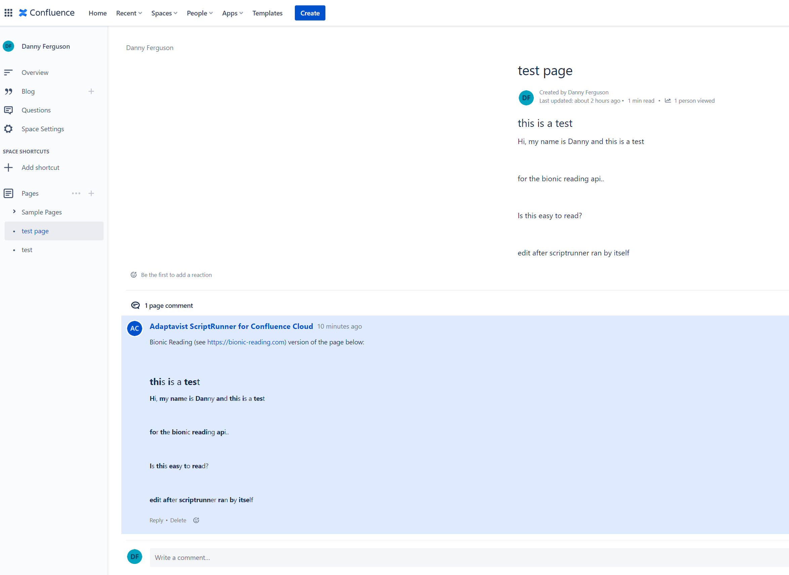
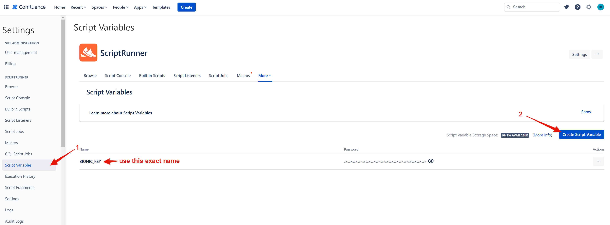

# ConfluenceScriptRunnerBionicReading

Played around with [Adaptavist's ScriptRunner app for Atlassian Confluence](https://marketplace.atlassian.com/apps/1215215/scriptrunner-for-confluence?tab=overview&hosting=cloud). Created a script that when ran can take a page and send its contents to the Bionic Reading API for translation and then it posts the result as a comment on the page.

Tried to make it a script listener that ran when a page was created/updated but could not figure out in the short time I played with this why it never ran.

 
 
 
You must create a script variable to safely store your API key. See:

 
 
### Current Issues:
* Will run into xhtml errors if the page contains anything other than basic text (like code snippets)

 
To read more about bionic reading, visit [https://bionic-reading.com/](https://bionic-reading.com/)

To get an API key, visit [https://rapidapi.com/bionic-reading-bionic-reading-default/api/bionic-reading1/](https://rapidapi.com/bionic-reading-bionic-reading-default/api/bionic-reading1/)